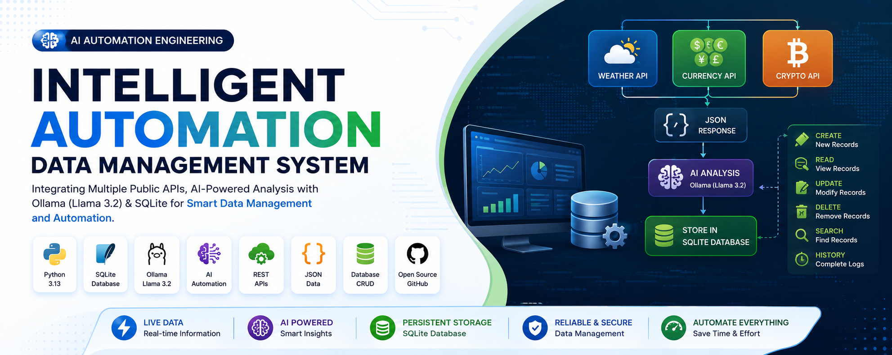
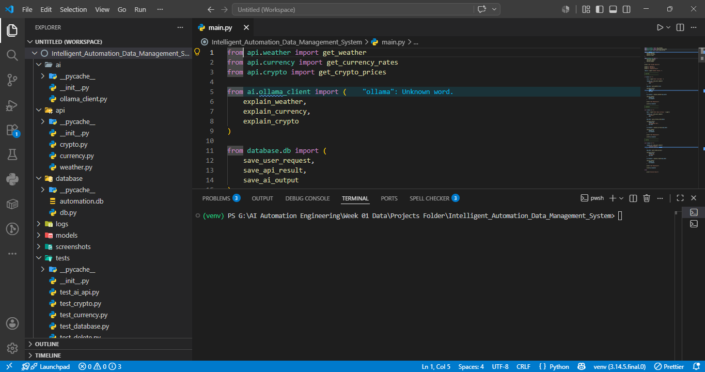
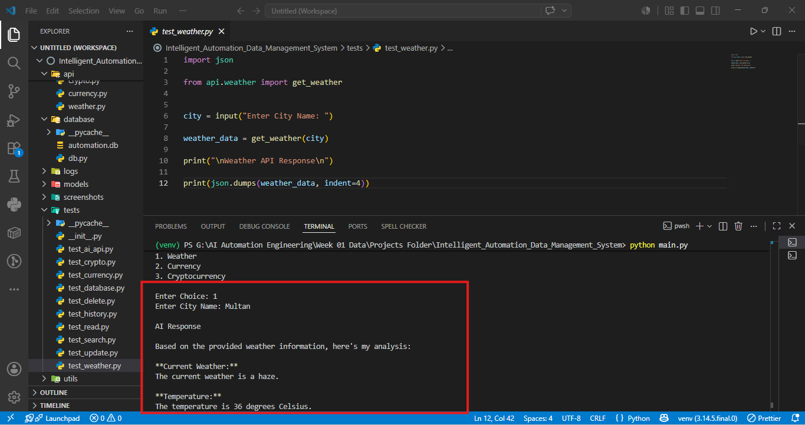
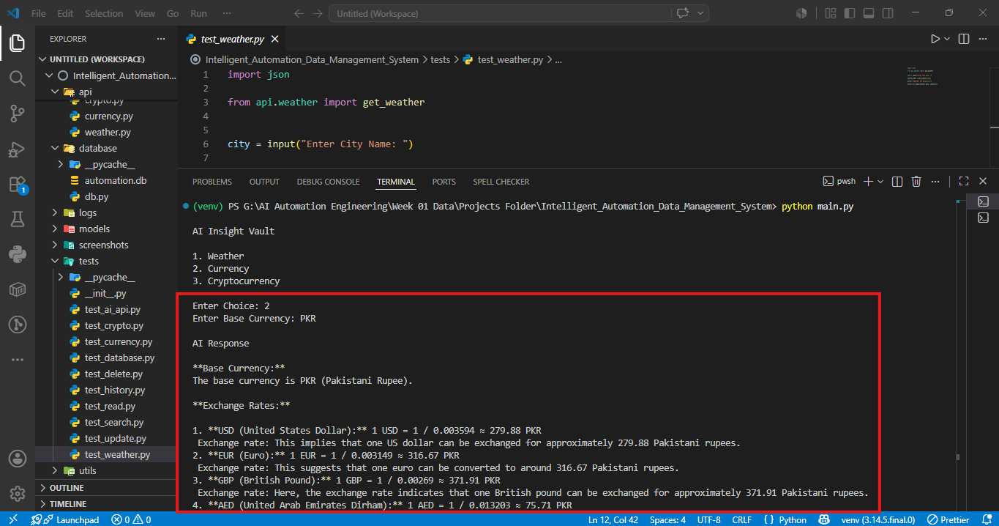
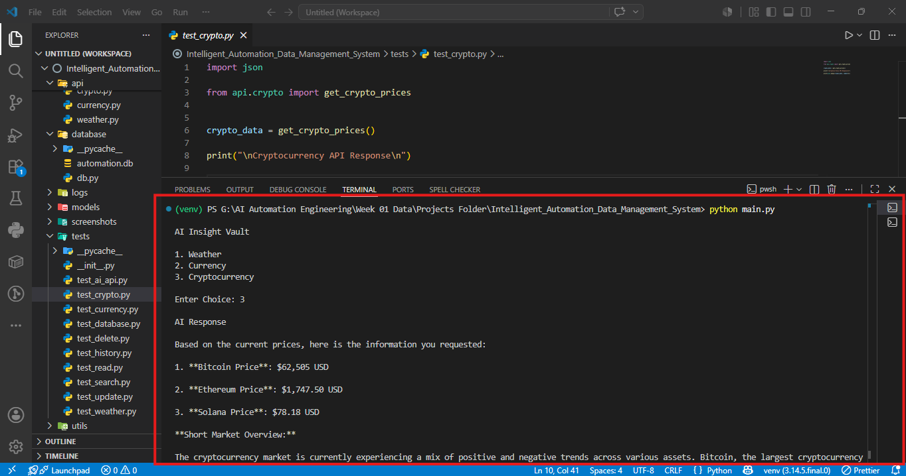
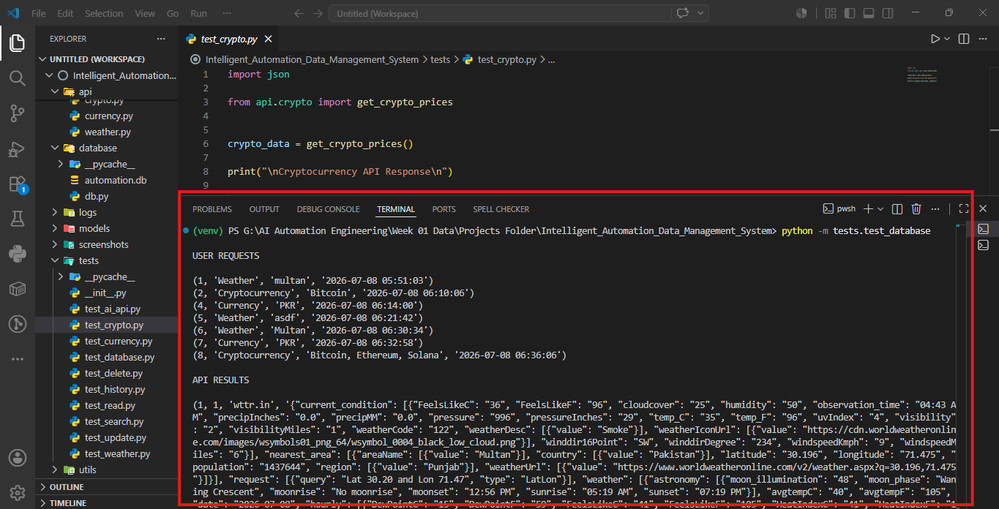
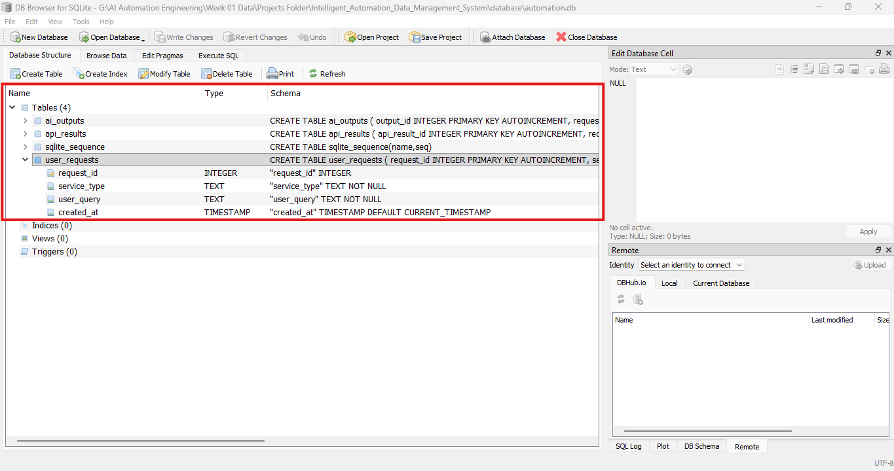

<p align="center">
  
</p>

# 🚀 Intelligent Automation Data Management System

<p align="center">


</p>

---

## 📌 Project Overview

The **Intelligent Automation Data Management System** is a Python-based AI automation project that integrates **multiple public APIs**, **local AI (Ollama)**, and **SQLite** into a single workflow.

The system retrieves live data from multiple services, generates AI-powered explanations using **Llama 3.2**, and stores every interaction in a structured SQLite database. It also provides complete CRUD (Create, Read, Update, Delete) functionality for professional data management.

This project was developed as part of my **AI Automation Engineering** learning journey.

---

# ✨ Features

- 🌦️ Live Weather Information
- 💱 Live Currency Exchange Rates
- ₿ Live Cryptocurrency Prices
- 🤖 AI-Powered Explanations using Ollama (Llama 3.2)
- 🗄️ Persistent Data Storage using SQLite
- 📄 JSON Parsing & Processing
- 📝 Store User Requests
- 📥 Store Raw API Responses
- 🧠 Store AI Generated Outputs
- 🔍 Search Stored Records
- ✏️ Update Existing Records
- 🗑️ Delete Records
- 📊 View Complete Automation History
- ⚡ Modular Project Architecture

---

# 🛠️ Technologies Used

| Category | Technology |
|----------|------------|
| Language | Python 3 |
| Database | SQLite |
| AI Model | Ollama (Llama 3.2) |
| APIs | Weather API (wttr.in), Exchange Rate API, CoinGecko API |
| Library | requests |
| Data Format | JSON |
| Version Control | Git & GitHub |

---

# 📂 Project Structure

```text
Intelligent_Automation_Data_Management_System/
│
├── ai/
│   ├── __init__.py
│   └── ollama_client.py
│
├── api/
│   ├── __init__.py
│   ├── weather.py
│   ├── currency.py
│   └── crypto.py
│
├── database/
│   ├── automation.db
│   └── db.py
│
├── logs/
│
├── models/
│
├── tests/
│
├── utils/
│
├── screenshots/
│
├── main.py
├── database_setup.py
├── requirements.txt
└── README.md
```

---

# 📸 Project Structure

<p align="center">

</p>

---

# 🌦️ Weather Automation

The application fetches live weather data, sends it to Ollama for intelligent analysis, and stores both the API response and AI-generated explanation inside SQLite.

<p align="center">

</p>

---

# 💱 Currency Automation

Retrieve real-time exchange rates from the Exchange Rate API and generate an AI-powered explanation.

<p align="center">

</p>

---

# ₿ Cryptocurrency Automation

Fetch the latest cryptocurrency prices using the CoinGecko API and generate an intelligent market summary.

<p align="center">

</p>

---

# 🗄️ Database Storage

Every automation request is permanently stored in SQLite.

Stored Information includes:

- User Requests
- Raw API Responses
- AI Generated Outputs

<p align="center">

</p>

---

# 💾 SQLite Database

Database verification using SQLite Browser.

<p align="center">

</p>

---

# 🔄 Complete Automation Workflow

```text
                 User

                   │

                   ▼

          Select Automation Service

                   │

                   ▼

      Weather │ Currency │ Crypto API

                   │

                   ▼

          Receive JSON Response

                   │

                   ▼

         AI Analysis using Ollama

                   │

                   ▼

      Store Everything in SQLite

                   │

                   ▼

      CRUD Operations (Read, Update,
           Delete & Search Records)

                   │

                   ▼

            Display Final Result
```

---

# 🗃️ Database Schema

### user_requests

| Column | Description |
|---------|-------------|
| request_id | Primary Key |
| service_type | Weather / Currency / Crypto |
| user_query | User Input |
| created_at | Timestamp |

---

### api_results

| Column | Description |
|---------|-------------|
| api_result_id | Primary Key |
| request_id | Foreign Key |
| api_name | API Name |
| raw_response | JSON Response |
| created_at | Timestamp |

---

### ai_outputs

| Column | Description |
|---------|-------------|
| output_id | Primary Key |
| request_id | Foreign Key |
| ai_response | AI Generated Output |
| model_name | Llama 3.2 |
| created_at | Timestamp |

---

# ▶️ Installation

Clone the repository

```bash
git clone https://github.com/YOUR_USERNAME/Intelligent_Automation_Data_Management_System.git
```

Move into the project

```bash
cd Intelligent_Automation_Data_Management_System
```

Create Virtual Environment

```bash
python -m venv venv
```

Activate

### Windows

```bash
venv\Scripts\activate
```

Install dependencies

```bash
pip install -r requirements.txt
```

---

# 🤖 Start Ollama

Make sure Ollama is installed.

Run

```bash
ollama serve
```

Verify the model

```bash
ollama list
```

---

# ▶️ Run the Application

```bash
python main.py
```

---

# 📚 Learning Outcomes

This project demonstrates practical implementation of:

- AI Automation Engineering
- Python Automation
- REST API Integration
- JSON Processing
- SQLite Database Design
- CRUD Operations
- AI Integration with Ollama
- Modular Python Architecture
- End-to-End Workflow Automation

---

# 🚀 Future Improvements

- GUI Interface
- Web Dashboard
- User Authentication
- PostgreSQL Support
- Docker Deployment
- Cloud Deployment
- AI Conversation History
- Export Reports (PDF/Excel)
- API Authentication
- Logging & Monitoring

---

# 👨‍💻 Author

**Abdul Qadeer**

Cloud Computing & AI Automation Engineering Student

Specializing in Cloud Security, Automation, and AI Workflow Engineering.
# Linkedin Profile: www.linkedin.com/in/abdulqaadeer

---

# ⭐ Support

If you found this project helpful, consider giving it a ⭐ on GitHub.
